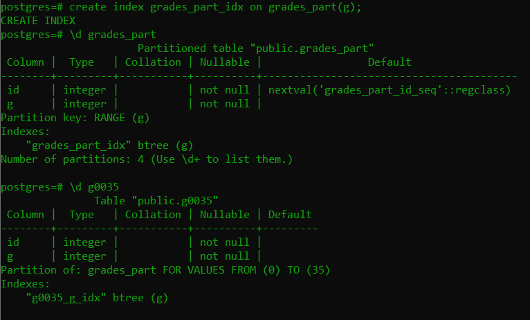

# Database-Partitioning-With-Postgres
Partitioning is a technique where you split up a huge table into multiple tables and let the database decide which table or which partition to hit based on the where clause.
So let's say we have a beautiful customer table here.


So we're going to select name from customer tables where ID equals seven hundred thousand and one.So what's gonna happen? If you have an index on the on that table, we're going to use the index and then we're going to land on that particular id on that disk.Or if we don't have index, we're going to do a sequential scan, which is the worst thing. But we have to scan all these rows until we find the rows we were looking for, regardless whether using an index or sequential scan.And scanning millions rows is a lot.

Partitioning is the idea to break the table down to smaller pieces so we only need to work with a smaller piece of the main table.So,let's break things up.One million rows into five partitions i.e. five tables


We can achieve both **Horizontal Partitioning** and **Vertical partitioning**.Horizontal Partitioning splits rows into partitions while Vertical partitioning splits columns into partitions.Vertical partitioning is useful while dealing with large column (blob) that you can store in a slow access drive in its own tablespace.

### Partitioning Types
* By Range

  Dates, ids (e.g. by logdate or customerid from to)
* By List

  Discrete values (e.g. states CA, AL, etc.) or zip codes
* By Hash

  Hash functions (consistent hashing).Cassandre uses that where where we use the hash function to spread the value.In the proxies we use IP hash.

### Demo - Example with Postgres 
We are going to
* Spin up a postgres instance with docker
* create a table and Insert 10 million rows
* Create partitions

First, run the following command from your CMD/WSL if you're in windows or from shell in case of linux

```
docker run --name pgmain -d -e POSTGRES_PASSWORD=postgres postgres
```

It will start a postgres instance.


And to start psql interactive terminal,do as follows


Then create a table `grades_org` and insert 10 million rows and create an index.It's evident that Column g will have values between 0 to 99


Now lets analyze a simple query by `explain analyze select count(*) from grades_org where g = 30;`.Look at the execution time.Also note that *index only scan* is used in this case


Now we will create the main partition table i.e. we will run query on this table after we're done with partioning.As you can see, `partition by range(g)` indicates that `grades_org` table will be partitioned by the values of column g and following 4 tables that are created afterwards, are evident to realize that g0035 contains rows that have value of g in between 0 to 35 , g3560 contains rows having g values from 35 to 60 etc.


Note that there's no index in g0035 table.Don't worry.As soon as we create index on `grades_part` table,All four tables(g0035,g3560,g6080,g80100) will have their own index too.Before that happens,we've to attach these 4 tables to main partition table,`grades_part`.


Now, the main partition table is empty as well as those partitioned tables.Let's insert into grades_part which will automatically insert into 4 partitioned tables as well


We can verify if the partitioned tables have really been populated or not


As I have told earlier, creating index on main partition table will automatically create indexes to those 4 tables.Lets have a look



Now we are all set.Let's run that query to find number of rows having g=30.This time,look at the index used.`Index Only Scan using g0035_g_idx`.So,we are hitting only the first partition,not the entire `grades_part` table.Wait,execution time(90ms) isn't very different from that of the query without partition(70ms).Why?


The reason is,if you think about it, my machine here is of 8 GB ram, and the Docker container doesn't have a limit.So it's going to use all the memory it needs and both are the same identical query.There is no bounding limit, there's no memory.If I limited the container to like 500 Megabyte And the index was so large such that it doesn't fit a memory, then you can start seeing the difference.To convince yourself,run the command and look at the sizes of each relation


The pg_relation_size given in bytes.

On a last note , there's one important thing to be remembered while partitioning tables in postgres.A boolean,`ENABLE_PARTITION_PRUNING` must be set on to achieve priviledges of partitioning.


If it is set off,any query will hit all the indexes instead of a single index.Let's have a look


